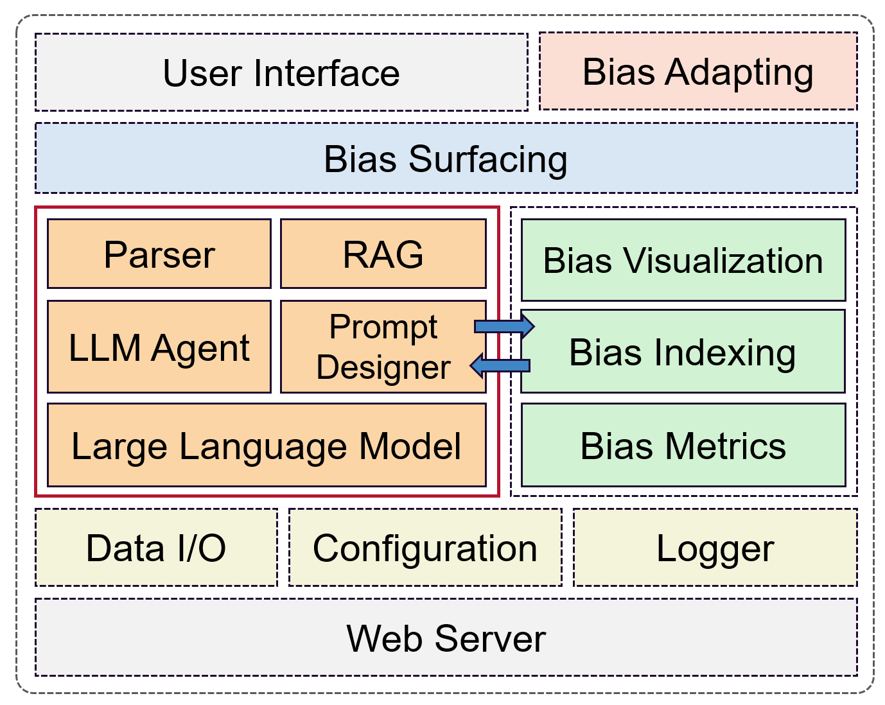

# BiasNavi
A data bias management toolkit developed by ARC Training Centre for Information Resilience [CIRES](https://cires.org.au/).

BiasNavi aims to manage the bias in datasets. It complies with the following pipeline:

+ **Identifying**: Identify if the data or system being used is subject to bias or fairness issues. 
+ **Measuring**: Quantify with an appropriate metric the magnitude of different types of bias present in the data or system being considered. 
+ **Indexing**: Collect, parse, structure, and store bias metadata and fairness policies aimed at facilitating a subsequent fast and effective retrieval and system adaptation. 
+ **Surfacing**: Present in an appropriate way to the end user the bias present in the underlying data and/or any fairness policy that have been applied to the data or system under consideration. 
+ **Adapting**: Provide the user with a set of tools that allows them to interact with existing biased results and to adapt them for bias in their preferred ways.

## Architecture


## Easy Setup
1. Run the following command to set up the project for the first time:
```bash
make setup
```
2. Config your API key and database URL in the file named `config.sample.yaml` under the root directory of the project and rename it to `config.yaml`
3. Start the program.
```bash
make run
```

## Additional Steps
To stop database containers, run:
```bash
make stop-db
```
To stop and delete database containers, run:
```bash
make clean-db
```
To start the database explicitly, run:
```bash
make start-db
```
