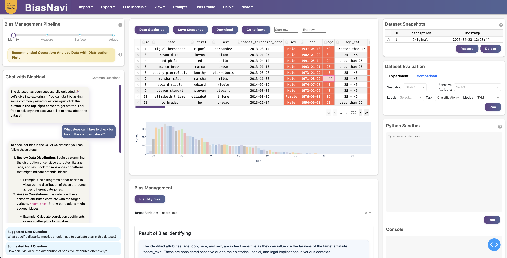

# BiasNavi
A data bias management toolkit developed by ARC Training Centre for Information Resilience [CIRES](https://cires.org.au/). It is a large language models (LLM)-empowered toolkit for data bias management. BiasNavi features an autonomous agent that seamlessly integrates with modules for bias identification, measurement, surfacing, and adaptation, reasoning over data and interactions to adaptively guide users through the bias management pipeline. With intuitive and personalized interfaces, BiasNavi empowers users to customize their workflows and address data bias effectively. 

BiasNavi complies with the following bias management pipeline:

+ **Identifying**: Identify if the data or system being used is subject to bias or fairness issues. 
+ **Measuring**: Quantify with an appropriate metric the magnitude of different types of bias present in the data or system being considered. 
+ **Surfacing**: Present in an appropriate way to the end user the bias present in the underlying data and/or any fairness policy that have been applied to the data or system under consideration. 
+ **Adapting**: Provide the user with a set of tools that allows them to interact with existing biased results and to adapt them for bias in their preferred ways.

## User Interface


## Architecture


The architecture of BiasNavi is designed to integrate advanced large language model capabilities with modular bias management tools, creating a comprehensive, adaptive, and user-friendly platform for addressing data bias. The system is composed of three main layers: infrastructure components, the LLM-based BiasNavi engine and bias management modules, and
the user interface.

## Agent Workflow


The agent serves as the core component. It is equipped with customized profile, memory, and planning modules. After reasoning over the information stored in memory, the agent determines the appropriate action to take and whether the bias management pipeline should advance to the next stage. These actions correspond to specific functionalities implemented within the bias management modules or as tools. 

## How BiasNavi Help Non-Experts for Data Bias Management

| **Challenge**                      | **How BiasNavi Solves It**                       |
|------------------------------------|--------------------------------------------------|
| Lack of technical expertise        | Conversational agent, plain-language guidance    |
| Difficulty understanding bias      | Visualizations with easy-to-understand insights  |
| Inability to configure tools       | Automated detection, prebuilt metrics            |
| No coding knowledge                | Actionable bias mitigation without manual coding |
| Uncertainty about next steps       | Recommendations, simulations, and workflows      |
| Communicating findings             | Automated reporting and visual narratives        |

## Demonstration Video
[Watch the demo video here](https://drive.google.com/file/d/1NwhJ1iGTbe4YTKYVyrJm2SmcO5GDn2y2/view?usp=sharing)

## Easy Setup
1. Run the following command to set up the project for the first time:
```bash
make setup
# Wait for the docker containers to start the run
make create-db
# To create user and database
```
2. Config your API key and database URL in the file named `config.sample.yaml` under the root directory of the project and rename it to `config.yaml`
3. Start the program.
```bash
make run
```

## Additional Steps
To stop database containers, run:
```bash
make stop-db
```
To stop and delete database containers, run:
```bash
make clean-db
```
To start the database explicitly, run:
```bash
make start-db
```

## Acknowledgement

We appreciate the work of [FairLens](https://github.com/synthesized-io/fairlens), which provides approaches and metrics to identify and measure bias. This project incorporates the code of FairLens and we have further modified and extended it to better suit our needs. The use of the code complies with the BSD 3 license.

